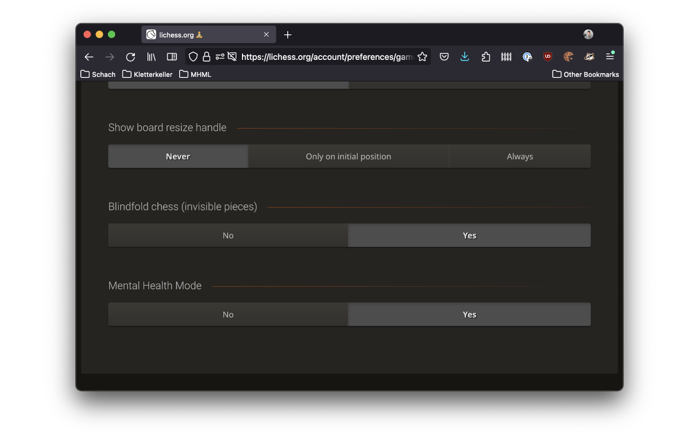
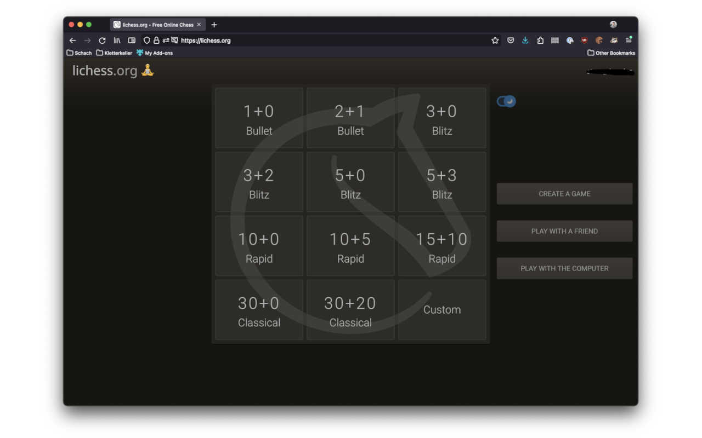
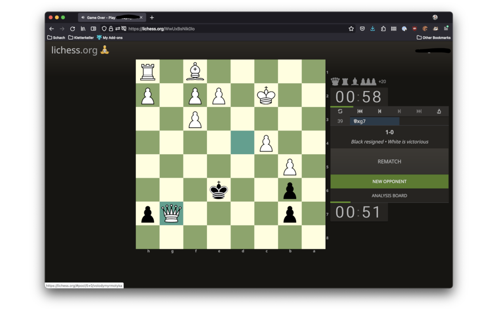
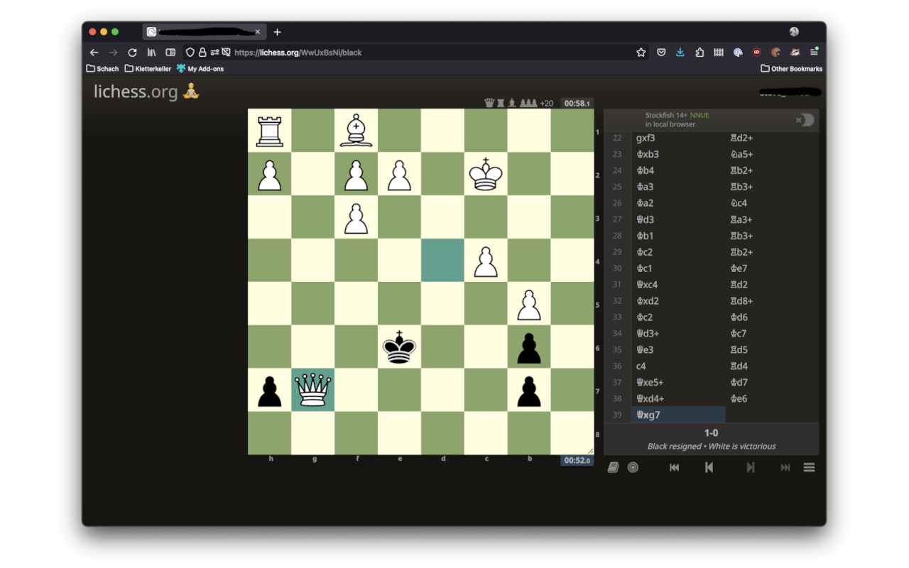

  

#  Mental Health Mode for Lichess
A browser plugin to make Lichess less stressing in regards of mental health. **And I am happy to say, that this extension is deprecated now and will not be continued. Why am I happy about this? [Read more](docs/deprecation/DEPRECATION.md).**

## Installation
Please install the extension here 
* for Firefox: https://addons.mozilla.org/en-US/firefox/addon/mental-health-mode-for-lichess/
* for Chrome: https://chrome.google.com/webstore/detail/mental-health-mode-for-li/jpfepkpncclpcbcgomeenoamcaaphpcl

## How to Activate Mental Health Mode
When installing the plugin, Mental Health Mode is activated by default. You can activate/deactivate it in the preferences, where a new toggle is injected.

## How Lichess Works With the Extension
On the home screen you can only start games but nothing else is displayed. No menu, no puzzles, no live games, et cetera. It is just about your next game. There is also a fancy 🧘 in the logo.

You cannot see yours and your opponent's name and rating anymore in a running game.

Even after the game is finished you cannot see how the player's rating changed.

In the Analysis Board nothing is shown which lets you see your current rating.

Your profile is not accessible from the user drop down menu anymore.

If you call your profile directly, you cannot see the history of your stats anymore. 

