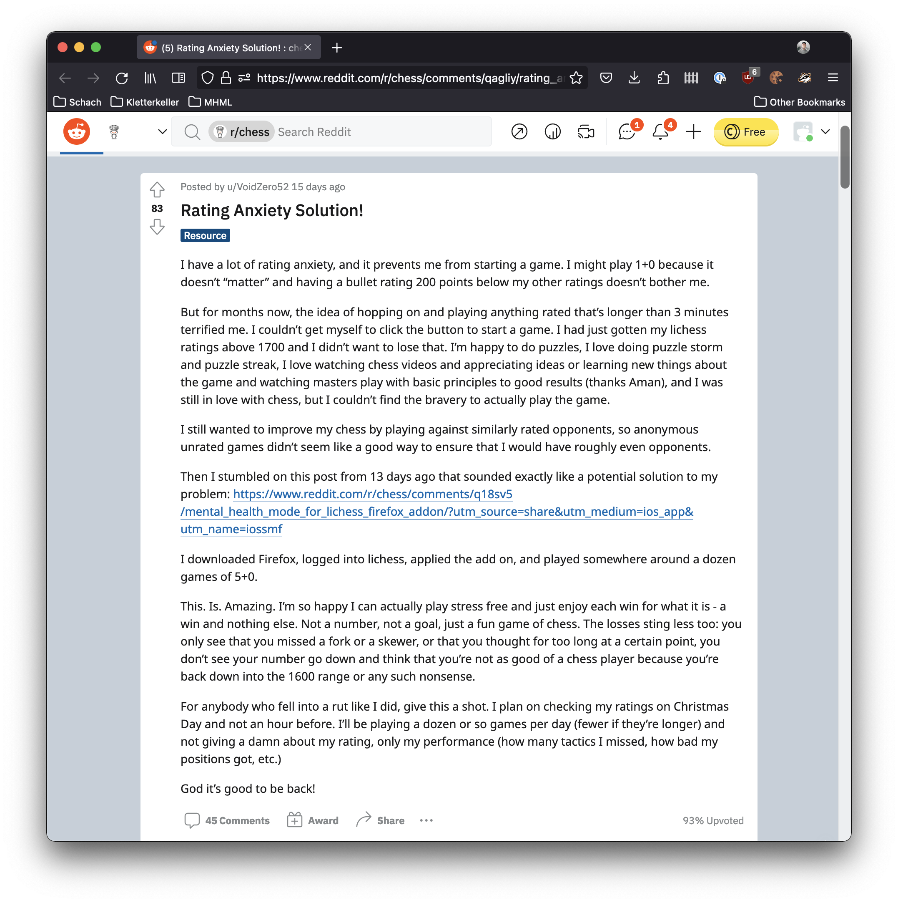
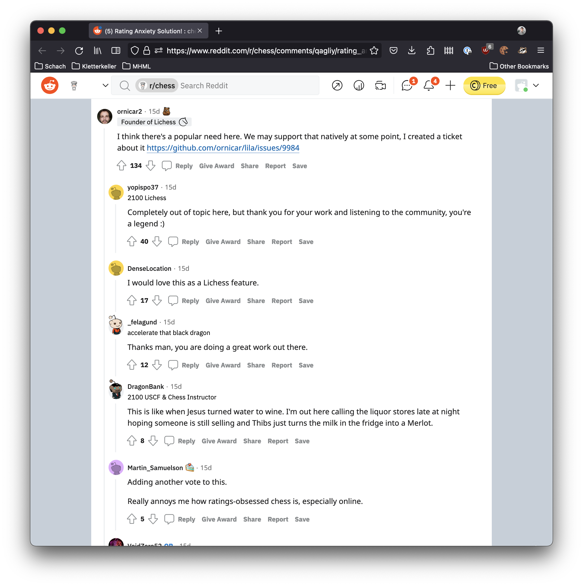
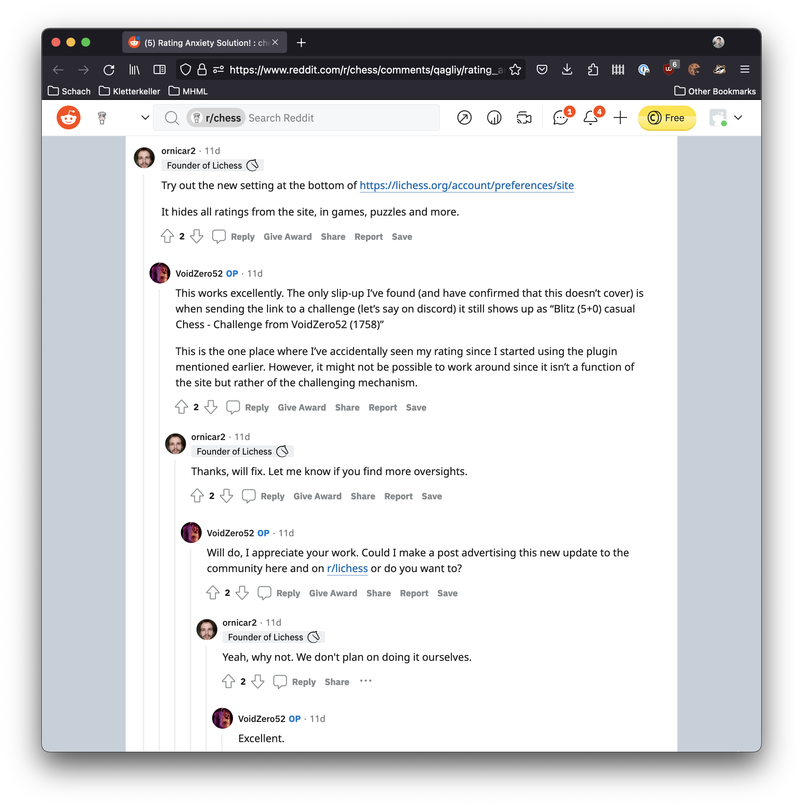

# Deprecation Note

I am happy to announce that the extension is deprecated. Why is it deprecated and why am I happy about this?

After developing this extension I proposed it on Reddit where it raised some attention. After announcing it, this repository gained some followers (including [ornicar](https://github.com/ornicar), the Lichess founder). But the number of installations stayed quite low. 

After a couple of weeks I opened Reddit and saw a [post](https://www.reddit.com/r/chess/comments/qagliy/rating_anxiety_solution/) from u/VoidZero52 who told the chess community about things he uses to fight his rating anxiety. He mentioned my extension there.

  

[ornicar](https://github.com/ornicar) saw the post and created the top comment including an Github issue promising to hide your ratings natively in Lichess. 

  

And there it is.

  

So I am happy that my extension was creating a discussion about the need of this feature.